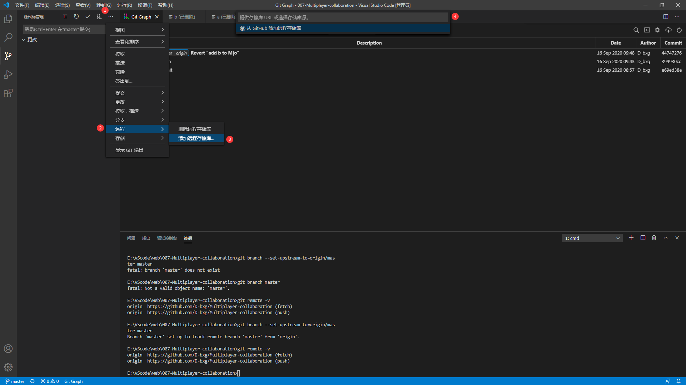
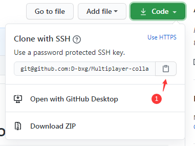
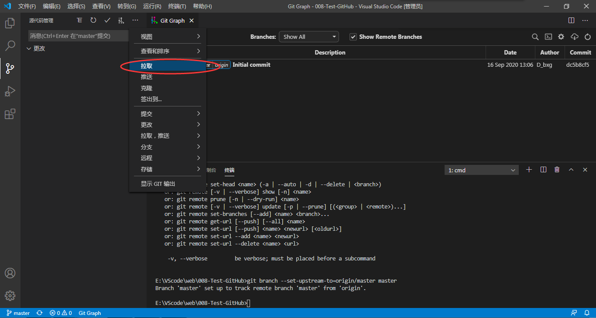
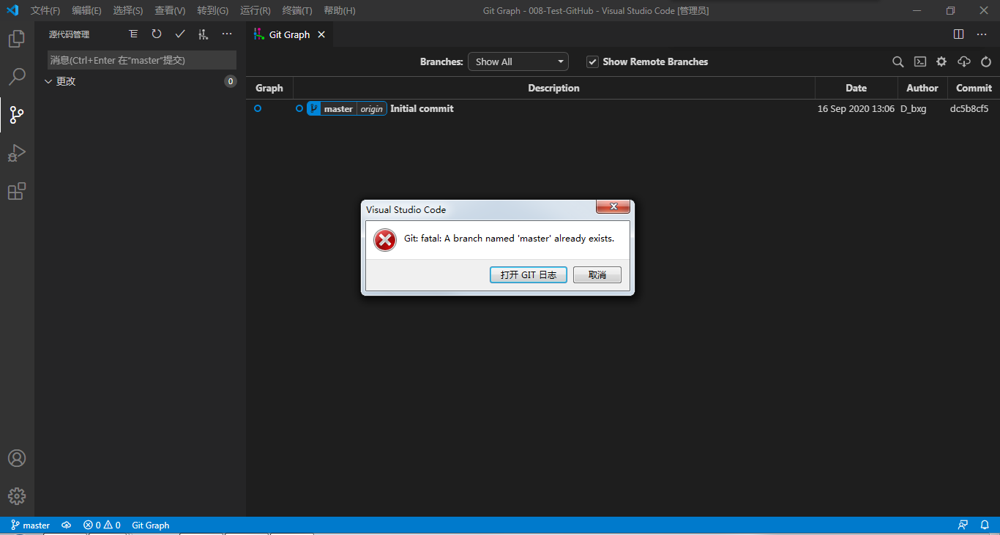
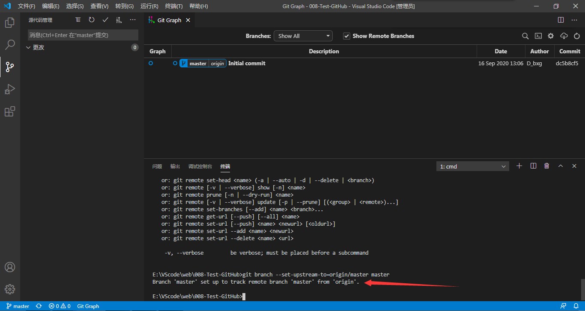
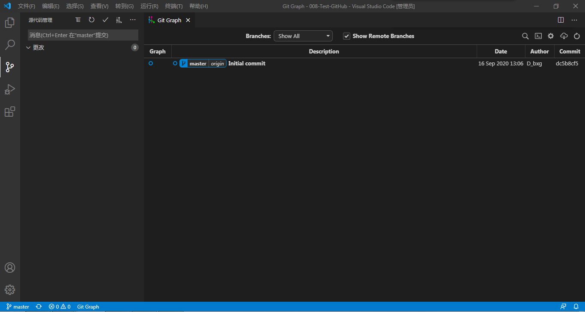
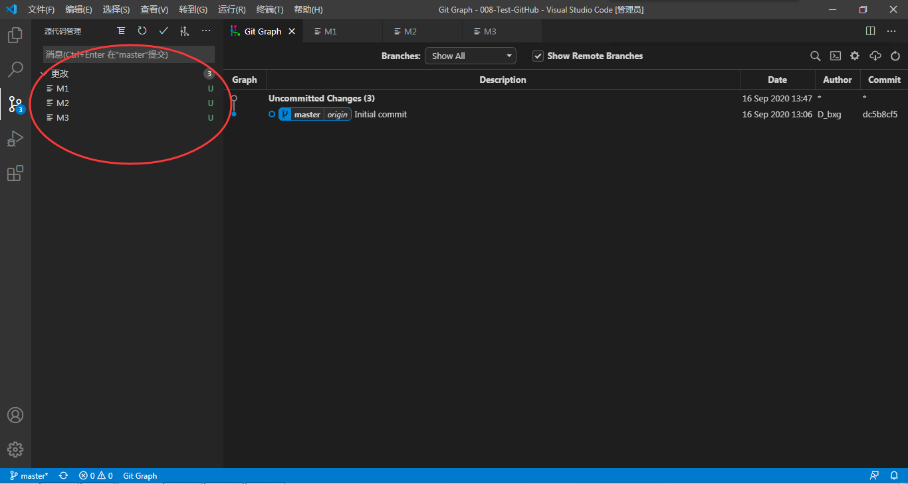
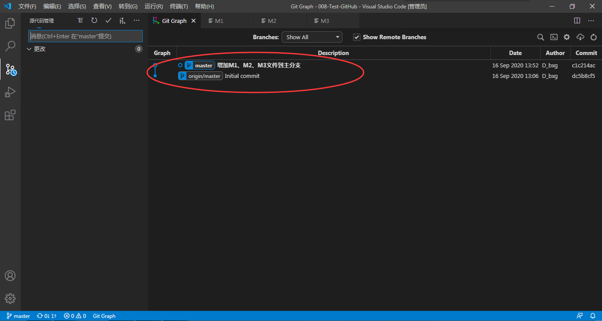
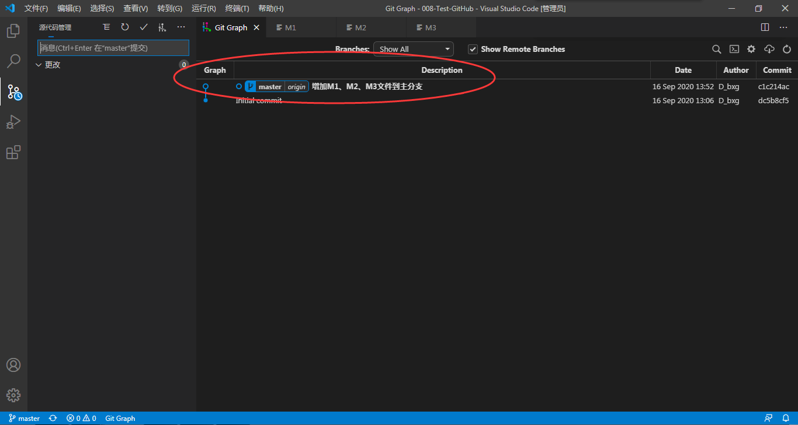

# GitHub

## 1 我会怎么讲解

和Git一样，我在此处不会讲解GitHub的基础使用，而是为下面的多人开发打基础，来讲解我们究竟是如何使用GitHub的。

## 2 GitHub是干嘛的？

GitHub有什么作用？

简单来讲，GitHub就是我们使用Git的原因，在本地管理项目时，除非项目十分庞大，要不然我们使用Git都有些“杀鸡用牛刀”。但因为我们要多人开发，每个人都相当于一条分支时，我们就相当有必要学习Git了。

那么GitHub是干嘛的呢？

GitHub有许许多多开源的项目，我们学习过Git后，都会知道Git有从远端pull项目和push自己项目的功能，所以，GitHub就和它的名字一样，许许多多用Git的人的俱乐部，或者讲大仓库，你在这里，有一处地方作为你自己的仓库。

## 3 GitHub的难点在哪？

尽管我们在本地进行Git管理项目时，感觉很顺畅，但再额外加一个GitHub远程仓库后，就会迎来一大批问题和用法。但不用担心，我会在这儿一一解释。

GitHub的难点在哪，笔者使用时，就遇到了许多问题，诸如：push不上去，pull不下来，pull下来再push上不去，push上去再pull不下来等等。但其实这些问题没那么复杂，让我们一步步来。

## 4 GitHub的使用步骤

GitHub的使用，就是**GitHub与本地连接，和上传下载的过程**。因此，我们遇到问题后，要抓住问题的本质，而此处我会一一解释各个问题的本质分别是什么。

我们可以先总览以下整个的步骤是怎样的：

1. 与远端仓库链接
2. 把远端仓库的分支pull下来
3. 把远端仓库的分支和本地分支合并起来
4. 在你本地开发完毕
5. 开发完毕后，按照你的需要上传

### 4.1 连接问题——remote

也许你正在使用GitHub，并且也建立了连接，但仍旧有一些问题要讲：

#### **4.1.1 ssh**

> 参考：
>
> [ssh如何连接GitHub](https://www.jianshu.com/p/da621e687c39)

我在此处用人话简述一下过程：

* 在制作ssh锁和钥匙前，首先要看一下我们电脑内有没有锁和钥匙。 它的所在路径是C:\Users\Administrator\.ssh  当然你也可以在Git Bash中使用下面代码，来查看是否拥有

```text
$ cd ~/.ssh
$ ls
```

* 如果我们没有ssh锁（公钥）和钥匙，那么我们就要制作一份

```text
$ ssh-keygen -t rsa -C "your_email@example.com"
```

* [然后把ssh锁给GitHub](https://blog.csdn.net/fenghuibian/article/details/73350890)
* 然后把本地和远程仓库（就是GitHub）进行连接，这些要在**初始化好本地仓库后**  在这个步骤中，有一些值的讲的： 你与远端建立连接时，相当于执行了下面这条Git命令：

```text
`这里使用的是ssh连接`
git remote add origin git@github.com:Username/projects.git

or

`这里使用的是https连接`
git remote add origin https://github.com/Username/projects.git
```

* **如果你使用ssh连接时出了很多错，没关系，把.ssh和本地初始化好的仓库全都删除，然后重新来一遍吧！**

#### **4.1.2 http**

无需上面配置ssh锁和钥匙的过程，直接进到上面的第4步：

### 4.2 下载问题——pull/fetch

在我们完成了本地与远端的连接后，下一步，就是把远端pull下来。我们先来聊聊，把远端的pull到本地这个过程，是做了什么。实际上就是，如果，远端有你本地没有的文件，那么就给你下载下来。这一步的目的是，当你在下一步的上传时，如果你远端有你本地没有的文件，你就无法上传。

把远端pull下来分为以下几个步骤：

#### 4.2.1

拉取远程仓库，该步骤只执行拉取，是为了好让本地仓库链接到远端仓库：



出现下面错误的原因是，你当前在自己本地的master分支上，而非远程仓库的master分支上（远程仓库的master分支样式：origin/master），出现这个错误没关系，因为它至少说明了**我们连接已经成功，只是pull失败**：


然后再使用下面该步骤拉取远程仓库分支，值的注意的是，无论你源仓库有多少分支，都是如此拉取。  
**若没有显示分支，则刷新一次即可。**  
若刷新也无效，则使用：

```text
git remote update
```


#### 4.2.**2**

**把本地的分支与远程的分支合并起来**，值的注意的是，无论你源仓库有多少分支，都是如此合并（如果远端的分支本地没有，则自行在本地创建后再连接远端分支）  
如果我们本地的master分支没有合并（链接）到远程的master分支连接，切换本地master分支和远端origin/master分支时就会出现下面该错误：



所以我们要把本地的master分支和远程的master分支链接（合并）一下，在终端中输入该指令：

```text
git branch --set-upstream-to=origin/master master
                                                                    ↑                       ↑
                                                这里是远端分支             这里是本地分支
```

#### 4.2.3

链接完成后，就可以自由的在本地和远程的master分支之间切换了，但实际上他们是一样的，因为这实际上是把这两个分支都合并了：



### 4.3 上传问题——push

在我们完成了remote，pull两个步骤后，上传问题就十分简单了。我们在使用Git时，没有着重讲暂存区，此处我想把暂存区再次讲解一下。

我们还记得，我在讲解Git时，用的都是诸如：M、D、F1等代号形式的1个文件，并且提到了“在你认为你把该功能完成后再进行提交”。但我们实际开发中，在一次上传前，会进行很多的操作，比如，你想完成一个功能，然后你创建了3个文件，修改了1个文件，那么你这一次提交前，这些文件都应当在暂存区，也就是讲，你在工作区，一直修改，并上传到暂存区，直到你满意，然后把暂存区的文件一次性上传，并描述你做了什么。

此处就牵扯到，如果我在本地建立了几个分支，但还没合并到远端master分支，解决方案就是你可以直接把这些分支也上传。同时笔者建议，在你进行自己的项目开发时，把所有分支都上传。因为这有助于查看你的项目，并同样深度掌握Git的人了解你的项目是如何一步一步建立起来的，这会让你的项目**可读性大大增强！**

让我们来看个小例子，来更好理解怎么上传：

#### 4.3.1

此时，我们的项目处于什么都没有的阶段：



#### 4.3.2

我们在本地进行了一些开发：



#### 4.3.3

并把他们暂存：


#### 4.3.4

然后提交：



到这个时候，你会发现，和剩下的步骤和你在本地开发是相同的，但多出来一个origin/master分支。这是因为你修改了这些文件后，并没有上传到远程服务器。你可以这样理解，远程服务器也是一条分支，这条分支和master分支是合并的，当然，你想分出去也完全可以。如果我们现在使用上传，那么你就会看到：



并且你的GitHub上也会更新。如此一来，如果你会使用Git，那么你就应当能独立完成把本地项目迭代，并上传至GitHub的步骤了！  
  
值的注意的是，分支和标签也都应该一并上传。

### 4.4 从别人那下载

刚刚我们讲过了，由你新建项目，并连接等等的步骤，我们可以注意到，在我们的项目的GitHub的仓库内，也并非是空的，而是有一个我们本地没有的README.mk文件，因此，在你pull别人的大型项目下来的时候，也和**3.4.2、下载问题**相同。

至于别的项目更改后你要怎么做，这就牵扯到了多人开发的问题了。

### 4.5 向别人那上传

该问题，是一种纯粹的多人开发需求，可以参考5**、多人开发。**

## 5 多人开发

我们至此，已经完全可以进行独立的，自己项目在本地和远端的管理了，而我们看到，与远端连接，在本地的显示，实际上也还是一种分支。

所以我们可以这么说，我们本地的分支，是从源项目分出去，最后合并到远端分支的。也就是说，每个参与多人合作的开发者，都是从源仓库origin/master分支分出去，到自己本地的master分支，然后在自己的developer分支上进行开发后，与本地的

